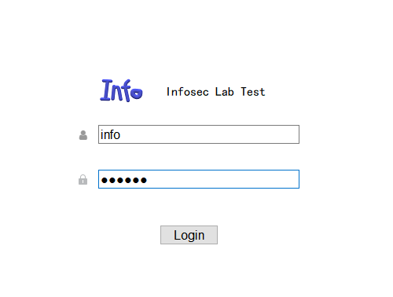
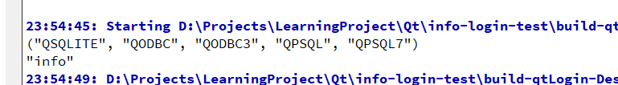

# qtLogin

# infoLoginTest

#### 介绍

新建数据库和表

* `create database neuralinfo;`

* ` create table users(user_name char(50), user_passwd char(50), primary key(user_name))engine=InnoDB;`

* `insert into users values('info','123456');`

#### 利用ODBC连接数据库

https://blog.csdn.net/joey_ro/article/details/105411135

#### 执行效果

